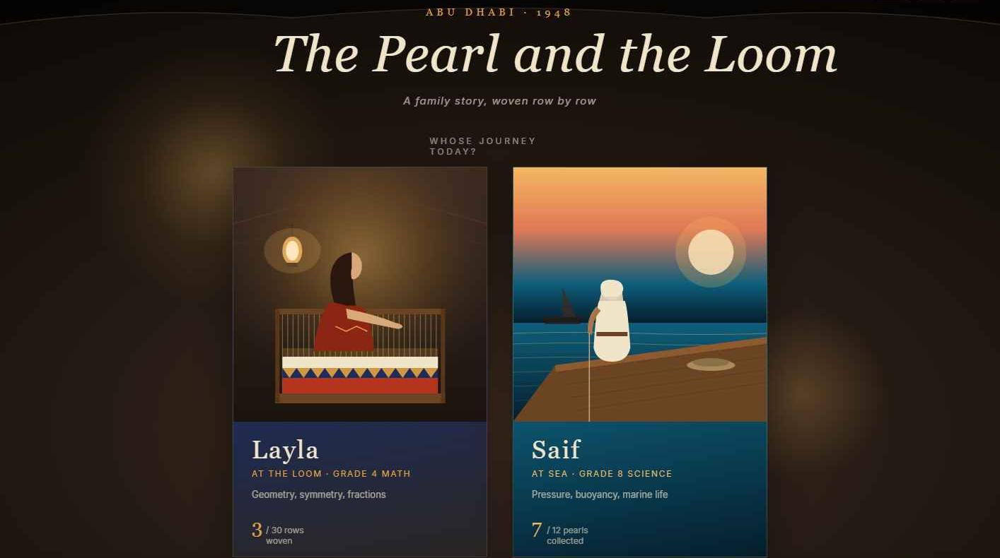
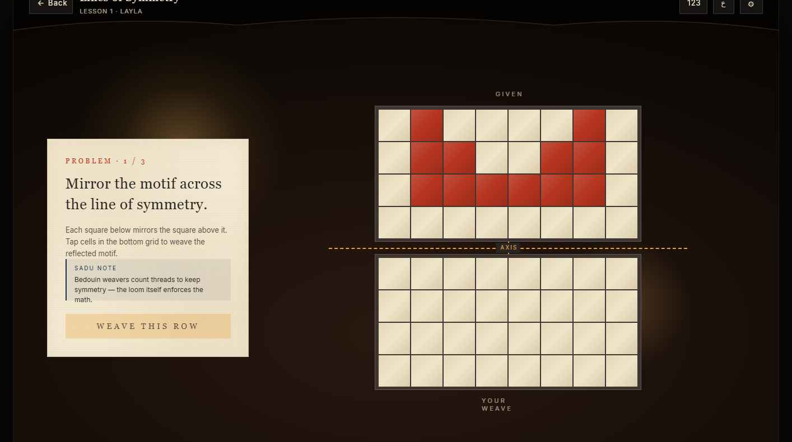
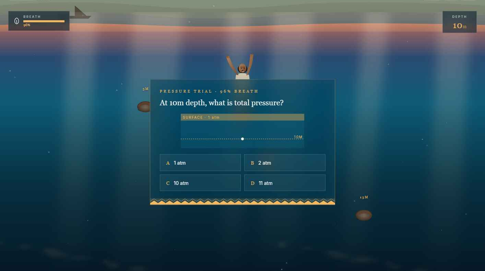
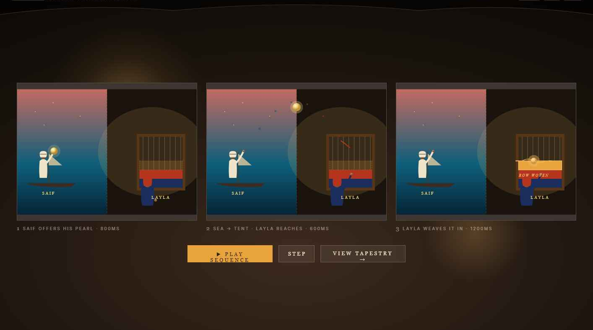
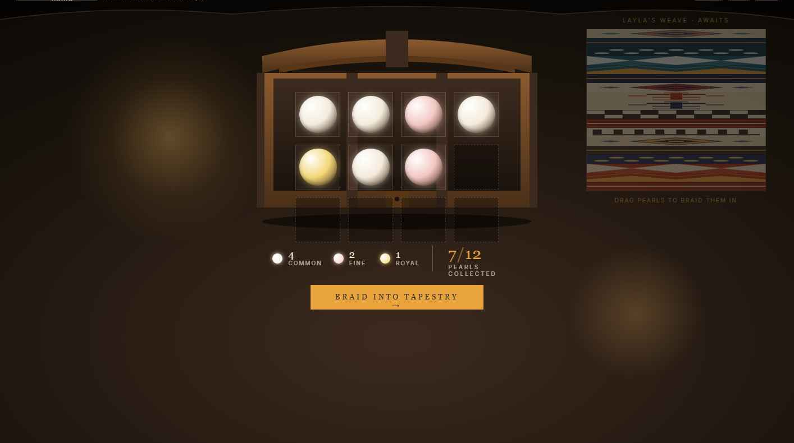
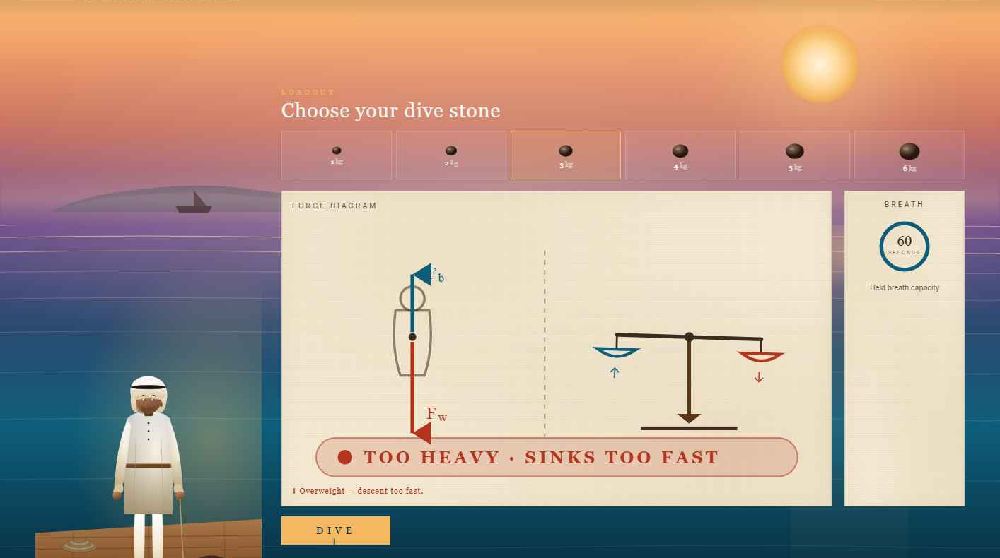
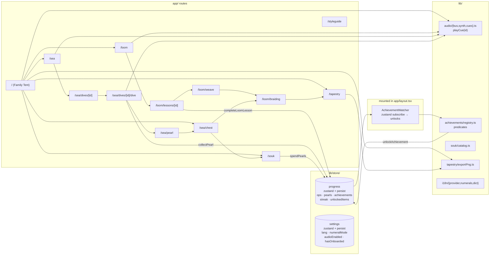

<p align="center">
  
</p>

<h1 align="center">The Pearl and the Loom · اللؤلؤة والنّول</h1>

<p align="center"><em>Two crafts. One family. One heirloom.</em></p>

A bilingual UAE-themed gamified learning path. **Layla** weaves Grade 4 math at the Sadu loom inside her family's tent. **Saif** dives Grade 8 science in the *ghasa* (pearling season). The pearls he brings home become beads in her tapestry — one heirloom, braided from two lives. Set in **Abu Dhabi, 1948** — the season before oil.

Submitted to the ADEK Frontend Developer (Interactive UI & Gamification) take-home challenge.

<p align="center">
  
  <br/>
  <sub><em>The Family Tent. Pick a sibling. The chosen path is the lesson.</em></sub>
</p>

---

## Live demo

- **App:** *(deployed by submitter — Vercel link goes here)*
- **Repo:** *(this repo)*
- **Pitch deck:** [`The Pearl and the Loom — ADEK Pitch.pdf`](./public/The%20Pearl%20and%20the%20Loom%20%E2%80%94%20ADEK%20Pitch.pdf)

---

## Walkthrough

<p align="center">
  <a href="https://youtu.be/YLkedUFAqDk" target="_blank" rel="noopener">
    
  </a>
  <br/>
  <sub><a href="https://youtu.be/YLkedUFAqDk" target="_blank" rel="noopener"><strong>▶ Watch on YouTube</strong></a> &nbsp;·&nbsp; narrated tour of every screen</sub>
</p>

A walkthrough of Layla's loom and lessons, Saif's dive, the pearl reveal, the souk economy, and the heirloom ceremony.

---

## Concept

The brief asked for an interactive, gamified learning path with strong UAE cultural integration. ~50 other 42-school applicants will likely converge on a Hope Probe / Mars / Solar System theme. **This project takes the opposite path:** it goes pre-oil, pre-modernity, into a 1948 Bedouin-coastal family, and binds two real UNESCO Intangible Cultural Heritage entries — **Al Sadu weaving (2011)** and **Pearl-diving (2005)** — into a single educational mechanic.

The student plays two siblings simultaneously:

- **Layla** sits at the Sadu loom inside the family tent. Each Grade 4 math problem she solves — symmetry, equivalent fractions, tessellation, multiplication arrays, geometric angles — weaves a real row of an evolving 25-row tapestry. The math *is* the loom.
- **Saif** sails on the family's dhow for the *ghasa* season. Each Grade 8 science problem — buoyancy and density, water pressure at depth, marine biology of the Arabian Gulf, lung capacity, light refraction — earns a graded pearl (common, fine, or royal). The science *is* the dive.

<table>
  <tr>
    <td align="center" width="50%">
      
      <br/>
      <sub><strong>Layla · Lesson 1.</strong> Mirror the motif across the axis. The grid she completes is the next row of the tapestry.</sub>
    </td>
    <td align="center" width="50%">
      
      <br/>
      <sub><strong>Saif · Pressure trial.</strong> Answer correctly before breath runs out — the pearl that surfaces is the grade of the answer.</sub>
    </td>
  </tr>
</table>

Pearls return home and become beads in Layla's tapestry. The completed heirloom is the family's story in cloth — the kind of thing a Bedouin bride's mother would wrap around her daughter's hand on her wedding day. Finishing the curriculum means finishing the heirloom.

<p align="center">
  
  <br/>
  <sub><em>The braid. Three frames: Saif offers a pearl · the pearl crosses sea-to-tent · Layla weaves it into the row.</em></sub>
</p>

The point isn't novelty for its own sake. The point is that **two UNESCO heritages are denser cultural integration than one**, and a deliberately pre-oil, dignified setting reads more confidently than a glossy "kids' app" gloss on a space mission. Reference points used during design: Louvre Abu Dhabi, Qasr Al Hosn, Sheikh Zayed Festival Sadu workshop documentation.

---

## Evaluation-axis self-mapping

The five rubric axes, each mapped to specific shipped features and the file paths where the work lives.

### 1. UAE cultural integration

- Two UNESCO Intangible Cultural Heritage entries braided into one mechanic — Al Sadu (2011) + Pearling (2005).
- 8 authentic Sadu motifs rendered as live SVG with their Arabic names and cultural notes: *al-mthalath, al-shajarah, al-eyoun, al-mushat, hubub, dhurs al-khail, uwairjan, khat*.
- Pearling vocabulary surfaced in lesson copy, souk items, and achievement footnotes: *ghasa, nahham, taab, fattam, deyeen, diveen*.
- 1948 setting threaded through chrome ("Abu Dhabi · 1948") and pitch.
- Souk al-Lulu (سوق اللؤلؤ) — every shop item carries a one-sentence pearling-era cultural footnote.
- 11 achievement badges (Wasm), each named after a real Sadu motif with a Bedouin weaving cultural note.
- Bilingual EN ⇄ AR everywhere, full RTL layout, Tajawal font for Arabic, Arabic-Indic numerals (٠–٩) with a per-user toggle.

**Where to find it:** `components/motifs/index.tsx` · `lib/souk/catalog.ts` · `lib/achievements/registry.ts` · `lib/i18n/dict/{en,ar}.ts` · `lib/i18n/numerals.ts`

### 2. Visual design

- Two distinct palettes (Sadu indigo / madder / saffron / wool · Sea blue / coral / sunset-gold / foam) under one type system.
- Cormorant Garamond × Tajawal type pairing via `next/font/google`.
- Character portraits as composed SVG (`CinematicLayla`, `SaifOnDeck`) — not raster art.
- Bedouin sandalwood pearl chest with mother-of-pearl Sadu inlay, brass strapping, indigo velvet interior — entirely SVG.
- Underwater dive scene with gradient depth fog, animated god rays, particulates, sea grass, caustics.
- Aged-paper, lantern-glow, and warp-line CSS textures used consistently.
- `/styleguide` exposes tokens, type ramp, motifs, and a live tapestry sandbox.

<p align="center">
  
  <br/>
  <sub><em>Family Heirloom chest. Brass-strapped sandalwood with mother-of-pearl Sadu inlay; pearls inside grouped by tier; Layla's in-progress weave on the right.</em></sub>
</p>

**Where to find it:** `components/portraits/*.tsx` · `app/sea/chest/page.tsx` · `components/sea/{DiveScene,fx}.tsx` · `app/globals.css` · `app/styleguide/page.tsx`

### 3. UI / UX

- Branded home header (favicon + wordmark + ornament rule + saffron chip row) with a mobile hamburger drawer at ≤ 640 px.
- Mobile-first responsiveness audited across iPhone SE 375 → iPad Air 820/1180 → desktop 1920.
- `TopChrome` on every inner page — back/home button + locale chips that collapse to the hamburger on phone.
- First-visit guided tour (4-step coach-marks) with Skip / Back / Next / replay-from-FAQ.
- "How it works" FAQ dialog and an embedded 90-second walkthrough video (Space-bar play/pause, mouse passthrough blocked).
- `prefers-reduced-motion` respected globally; audio defaults on but is one-tap mutable from three nav surfaces.
- `aria-pressed` / `aria-modal` / `aria-live` used where relevant; every dialog dismisses on Escape and traps body scroll.

**Where to find it:** `components/layout/{HomeHeader,TopChrome,MobileNav}.tsx` · `components/onboarding/OnboardingTour.tsx` · `components/home/{Tutorial,Walkthrough}Dialog.tsx` · `app/globals.css`

### 4. Micro-animations

- Web Audio API synth with 9 named cues — every meaningful interaction has a sound: loom thump, glass-pearl ping, royal-pearl chord flourish, water splash, brass coin clink for souk purchase, achievement bells, ceremony chord.
- Loom row weave-in animation (clip-path reveal + shimmer).
- Cinematic dive plunge.
- Pearl reveal — oyster shell opens 58° around its hinge, light flare bursts, pearl rises.
- Achievement unlock toast slides down with the motif badge rendered live.
- Onboarding tour rises from below with saffron arrow callouts.
- Streak-chain saffron diamonds animate in as days accumulate.
- Saif's animated `saifBreathe` on the dhow, swaying sea grass, rising bubbles, depth-tinted Saif underwater.
- Heirloom-complete ceremony — staggered row fade-in, ornament reveal, layered chord cue, save-as-PNG / save-certificate CTAs.

<p align="center">
  
  <br/>
  <sub><em>Pre-dive force diagram. Pick a stone — buoyancy vs. weight updates live; "TOO HEAVY" / "TOO LIGHT" verdicts gate the dive. Real Grade-8 physics.</em></sub>
</p>

**Where to find it:** `lib/audio/{bus,synth,cues}.ts` · `components/sea/{DiveScene,fx}.tsx` · `components/portraits/Portraits.tsx` · `components/achievements/UnlockToast.tsx` · `components/ceremony/HeirloomCeremony.tsx`

### 5. Student journey / gamification

- **Real currency loop** — pearls earned in dives become spendable at Souk al-Lulu (9 items across 3 stalls). Owned items have *real downstream effects*: the *fattam* noseclip extends starting breath by 10 and slows drain by 15%, the *diveen* stone speeds Saif's descent 1.5×, the *deyeen* net awards a free common pearl per dive, the brass-lantern + dawn-sky heirlooms re-skin every TentScene.
- 11 achievement badges (Wasm) — each is an authentic Sadu motif with a cultural footnote. Locked = grayscale silhouette; unlocked = saffron with a brass-toast slide-in.
- Daily-weave streak tracking — increments per calendar day a lesson or dive is completed, resets after a 1-day gap. Powers the `streak_3` / `streak_7` achievement badges and is baked into the saved tapestry / certificate captions.
- Onboarding tour explains the braid in 25 seconds — *math weaves rows, science earns pearls, pearls braid into the tapestry*.
- Tapestry PNG export bakes the user's date / row-count / streak into the saved image; Web Share API integration for native mobile share-sheets with the PNG attached.
- **Heirloom-complete certificate** — full-screen ceremony fires once on completion; user signs their name; downloads a tapestry-themed PNG certificate with their name as the centerpiece, two Sadu motif bands, and a sealed-at-Abu-Dhabi date line. Also accessible from `/tapestry` once complete.
- Per-user deterministic `seed` exposed as a shareable permalink (`/tapestry?seed=…`) — opens a read-only view of someone else's finished heirloom.
- Lesson unlock gate (`arrays`, `angles` unlock at 3 core completions).

**Where to find it:** `lib/store/progress.ts` (Zustand + persist v4) · `lib/souk/{catalog,effects}.ts` · `app/souk/page.tsx` · `lib/achievements/registry.ts` · `components/achievements/*` · `lib/tapestry/{exportPng,buildCertificate}.ts` · `components/ceremony/HeirloomCeremony.tsx`

---

## UAE cultural research

### Al Sadu motif glossary

The 8 motifs that compose the tapestry — every one has a name, a meaning, and is woven by living Bedouin weavers today.

| ID | Arabic | Latin | Meaning |
|---|---|---|---|
| `mthalath` | المثلث | al-mthalath | Triangles paired tip-to-tip — the most ancient Sadu pattern, taught first to every weaver's daughter. |
| `shajarah` | الشجرة | al-shajarah | Tree of life — woven only for cloth meant for a wedding, a birth, or a homecoming. |
| `eyoun` | العيون | al-eyoun | "The eyes" — a guardian motif on tent dividers, woven to ward against ill intent. |
| `mushat` | المشط | al-mushat | "The comb" — references the comb that beats every weft thread tight against the row above. |
| `hubub` | حبوب | hubub | Grain seeds — the dot bands a weaver counts under her breath as she keeps the math of the cloth. |
| `dhurs` | ضرس الخيل | dhurs al-khail | "Horse-teeth" — alternating squares in the rhythm of the *nahham*'s breath chant. |
| `uwairjan` | عويرجان | uwairjan | Facing-triangle border — reads the same from either side, like a tongue at home in two directions. |
| `khat` | خط | khat | Warp band separator — once used by merchants to mark the size of a bolt of cloth. |

Sources: UNESCO ICH Register entry **00517** (Al Sadu, 2011), Sheikh Zayed Festival Sadu workshop documentation, Sharjah Heritage Institute publications, Anthropological Museum of Abu Dhabi displays.

### Pearling vocabulary

Used in the dive scenes, Souk al-Lulu copy, and achievement footnotes.

| Term | Arabic | Meaning |
|---|---|---|
| *ghasa* | الغوص | The summer pearling season — 4 months at sea, June through September. |
| *nahham* | النَّهَّام | The dhow's singer, whose chant kept the rhythm of breath for divers. |
| *taab* | الطاب | The diver's noseclip, traditionally tortoiseshell. |
| *fattam* | فطّام | Synonym for *taab* — boys carved their first one at age 12. |
| *deyeen* | الديين | The hand-stitched basket the diver wore around his neck for oysters. |
| *diveen* | الزِّبيل | The honed stone weight tied to the diver's foot for descent. |

Sources: UNESCO ICH Register entry **00010** (Pearling, testimonies, and ways of life — UAE, 2005), *The Pearling Trade in the Arabian Gulf* (Gulf Heritage Press), Heard-Bey, *From Trucial States to United Arab Emirates* (1996, Chs. 4–5).

---

## Stack & rationale

| Choice | Why |
|---|---|
| **Next.js 16 App Router** | File-system route groups for `(loom)` / `(sea)` palette layouts; static generation for content pages; one-line Vercel deploy. |
| **React 19 + TypeScript strict** | Strict types enforce store/action contracts and prevent regressions on the Zustand persist migrations. |
| **Tailwind v4** | Used sparingly — most styling is inline + scoped `<style>` blocks because the design uses many one-off textures and gradients that Tailwind can't express compactly. |
| **Zustand + persist (versioned)** | Two stores (`progress`, `settings`), both at persist version 2 with safe-default migrations. localStorage only — no backend. |
| **Web Audio API synth (no sample files)** | Eight named cues are rendered live via composed `OscillatorNode` + `BufferSourceNode` + `BiquadFilterNode` graphs in `lib/audio/synth.ts`. **Zero asset bytes shipped for audio.** No third-party audio license to credit. |
| **Custom canvas tapestry exporter** | `lib/tapestry/exportPng.ts` re-implements every Sadu motif natively in `CanvasRenderingContext2D` and emits a 2× DPI PNG with saffron frame and the user's date / row-count / streak baked in. No `html-to-image` dep. |
| **SVG everywhere for art** | Loom, dhow, oysters, characters, motifs, chest — all hand-authored SVG. Resolution-independent, animatable, and small. |
| **Vitest + RTL + jsdom** | **84 unit tests** (82 passing + 2 canvas-skipped) across 10 files. Wired into a `prebuild` hook so every Vercel deploy runs the full verify chain — typecheck, lint, tests — before bundling. No E2E (deliberate scope cut for time). |
| **Framer Motion** | Used only for the home language-splash `AnimatePresence`. Every other animation is CSS keyframes — keeps the JS bundle lean. |

---

## Architecture



---

## Run locally

```bash
pnpm install
pnpm dev          # http://localhost:3000

# focused checks
pnpm typecheck    # tsc --noEmit
pnpm lint         # eslint
pnpm test         # vitest run (all 84 tests, 2 canvas-skipped)
pnpm test:watch   # vitest watch mode

# orchestrated
pnpm verify       # typecheck && lint && test  ← hooked into prebuild
pnpm build        # runs verify automatically, then next build
```

Node ≥ 20 required.

---

## Quality pipeline — every build is verified

`package.json` declares a **`prebuild` lifecycle hook** that runs the full `verify` chain (typecheck → lint → tests) before `next build` ever runs. This applies **locally and on Vercel**. If a single test fails, the production deploy fails — there's no "ship a broken thing" path.

```text
pnpm build
  └─ prebuild
       └─ pnpm verify
            ├─ pnpm typecheck     (tsc --noEmit)
            ├─ pnpm lint          (eslint)
            └─ pnpm test          (vitest run)
  └─ next build                   (only if verify passed)
```

Sample pipeline output:

```text
> pnpm build
> pnpm verify

> pnpm typecheck && pnpm lint && pnpm test

✓ tsc --noEmit                    (0 errors)
✓ eslint                          (0 errors, 0 warnings)
✓ Test Files  10 passed
✓      Tests  82 passed | 2 skipped (84)

▲ Next.js 16.2.4 (Turbopack)
✓ Compiled successfully in 2.1s
✓ Generating static pages (12/12)
```

---

## Testing

**84 unit tests** across **10 test files**, all running in **~2 s** under Vitest + jsdom.

| File | Coverage |
|---|---|
| `tests/pattern-engine.test.ts` | Full unit suite for the deterministic pattern engine — PRNG seeded by `seed + rowIndex`, op-application invariants, motif math. |
| `tests/numerals.test.ts` | Western ↔ Arabic-Indic conversion (`toArabicIndic(42) === "٤٢"`), mode resolution, formatter integration. |
| `tests/progress-spend.test.ts` | `spendPearls` correctness — refuses on insufficient pearls, consumes oldest un-woven first, idempotent on duplicate item id, woven pearls are heirloom-protected, mixed-tier costs (e.g. "1 royal + 2 fine"). |
| `tests/progress-streak.test.ts` | `bumpStreak` calendar math under a frozen system clock — same-day no-op, +1 day increment, gap > 1 day reset, null lastDate. |
| `tests/achievements.test.ts` | Table-driven predicate coverage for every entry in `ACHIEVEMENTS` plus bilingual-content sanity. |
| `tests/souk-effects.test.ts` | `deriveSoukEffects` for every gear/heirloom/thread item, multi-item composition, unknown-id robustness. |
| `tests/souk-catalog.test.ts` | Souk catalog integrity — 9 items balanced 3-3-3 across stalls, unique ids, every item declares all bilingual fields, every id resolves to a real downstream effect, namespace conventions. |
| `tests/tapestry-composition.test.ts` | TAPESTRY_25 has exactly 25 rows, every motif resolves to a registered SVG component, every pearl-bearing row uses a valid grade, motif vocabulary is broad. |
| `tests/pearl-colors.test.ts` | `PEARL_TIERS` integrity — every grade, well-formed hex / rgba, escalating glow size, royal-only ring. |
| `tests/tapestry-export.test.ts` | Smoke: `buildTapestryPng` resolves to a PNG `Blob` (skipped under non-canvas). |

**Deliberately not tested:** E2E, visual regression, audio output (no headless WebAudio in CI), Framer Motion timelines, R3F / WebGL scenes. The cost-to-coverage on those isn't worth a take-home's deadline; the regressions they'd catch are caught by the integrity tests above.

---

## ADRs (architectural decisions)

### ADR-001 · Custom SVG pattern engine over pre-baked images

**Decision.** Build a deterministic, op-log-driven SVG tapestry generator (`lib/pattern-engine/`) rather than baking 25 PNG row variants.

**Why.** The math binds to the cloth. Symmetry / fractions / tessellation lessons each emit a typed `PatternOp` that the engine resolves into Sadu motif rows. The tapestry visibly grows as students answer correctly. Pre-baked images cannot do that — and would also obscure the only piece of logic that judges who probe the code will look at.

**Trade-off.** Higher up-front cost; harder for non-engineers to design new motifs. Mitigation: motif components are isolated in `components/motifs/index.tsx` and easy to extend.

### ADR-002 · Web Audio API synth over sample files

**Decision.** Render every audio cue live via `OscillatorNode` + `BufferSourceNode` + `BiquadFilterNode` graphs (`lib/audio/synth.ts`) rather than shipping mp3/wav sample files.

**Why.** Three reasons. First, no third-party audio license — every byte is original. Second, zero asset weight — the dive scene's "low-breath heartbeat" cue would be 30 KB as a wav, but is ~0 KB as a synth recipe. Third, audio cues stay deterministic across browsers; no decoding fallbacks.

**Trade-off.** Synth-rendered audio sounds slightly more "synthetic" than a curated wav. Mitigation: cue recipes layer noise + bell partials + pitched bass to read as wood/glass/water rather than pure tones.

### ADR-003 · Home-rolled i18n vs `next-intl`

**Decision.** A ~100-line `lib/i18n/provider.tsx` with typed dictionaries (`Dict = typeof en`) and a `useT()` hook, instead of `next-intl` or `react-intl`.

**Why.** Bundle weight (next-intl is ~15 KB gzip) and total control over RTL. Need to set `<html dir>` from a context, gate `dir="ltr"` SVG canvas wrappers manually, and pair Arabic-Indic numerals with a custom `<NumeralText>` — all easier without a library's opinion on each.

**Trade-off.** No pluralization / interpolation library features. Acceptable: this codebase has no plural-forms problems and uses template literals for interpolation.

### ADR-004 · Mock data only, no backend

**Decision.** All persistence is `localStorage` via Zustand `persist` middleware. No API routes, no database, no auth.

**Why.** The brief explicitly accepts mock data. A backend would not score on any rubric axis (the role is *frontend*) and would introduce failure surface (DNS / SSL / DB downtime) that could break the submission on judging day. The pearl economy, achievements, streak, and onboarding flag all persist in browser storage — verified to round-trip across reloads.

**Trade-off.** Can't move data across devices. Offset partially by the `?seed=` permalink: the deterministic per-user seed is shareable as a URL.

---

## Asset credits

| Asset | Source |
|---|---|
| All SVG art (motifs, characters, chest, dhow, oysters, ornaments, favicon) | Authored for this project (some compositions iterated via Claude Design exports). |
| Audio cues | Rendered live via Web Audio API. **No sample files.** |
| Fonts | Tajawal & Cormorant Garamond (both Open Font License) via `next/font/google`. |
| Pitch deck PDF | Authored for this project. |
| Walkthrough video | Self-contained inline HTML with embedded base64-audio data URIs (`public/Pearl-and-Loom-inline.html`). |

---

## Accessibility

- **RTL** — full Tailwind v4 logical properties (`ms-`, `me-`, `ps-`, `pe-`) plus `inline-start` / `inline-end` everywhere. Tapestry SVG internals are explicitly tagged `dir="ltr"` so motif coordinates stay positive-X-right while the *frame* flips with locale.
- **Numerals** — `<NumeralText mode="auto" | "western" | "arabic-indic">`. Math problems render in active mode and offer an explicit toggle so kids practice both. URLs and lesson IDs always western for routing stability.
- **Audio** — defaults on, persisted, one-tap mute (header chip + hamburger drawer + per-page TopChrome chip). All cues respect the toggle.
- **Reduced motion** — `@media (prefers-reduced-motion: reduce)` clamps all animation durations to 0.01ms in `app/globals.css`. The audio toggle is independent (motion ≠ audio).
- **Keyboard** — every dialog is `aria-modal`, dismisses on Escape, traps body scroll while open. Focus order through lessons follows the question → grid → CTA flow.
- **Live regions** — `aria-live="polite"` on the achievement unlock toast and the souk purchase confirmation toast.

---

## What's next (with another 17h)

Honest list of what didn't land in the time budget:

- **Real Dives 4 & 5** (lung capacity / refraction). Currently locked content; the gate is itself a deliberate signal but real lessons would close the loop.
- **Active palette feeding the live pattern engine.** The Souk's thread skeins are inventory unlocks today — wiring the active palette into `lib/pattern-engine/palette.ts` would re-tint future tapestry rows on purchase.
- **WebGL dive scene.** The current SVG dive is good but a real WebGL scene (R3F + a custom water shader, animated god rays, fish models) would push the visual axis further. R3F + Drei + Three are installed and ready.
- **Voice narration.** Short EN/AR clips for Layla and Saif's intros. Skipped for content-sourcing risk.
- **Server-rendered mock analytics** — a "your weekly heirloom progress" line chart fed by stored event timestamps.

---

*Submitted by Bilal Saeed Ahmed for the ADEK Frontend Developer (Interactive UI & Gamification) take-home, April 2026.*
