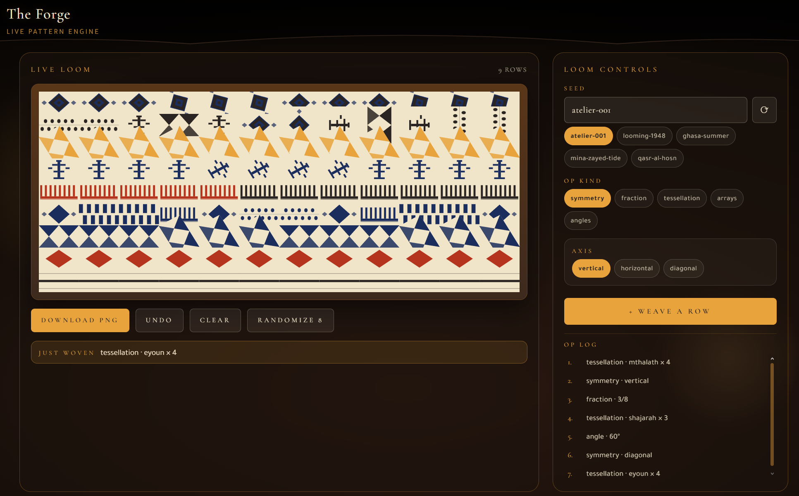
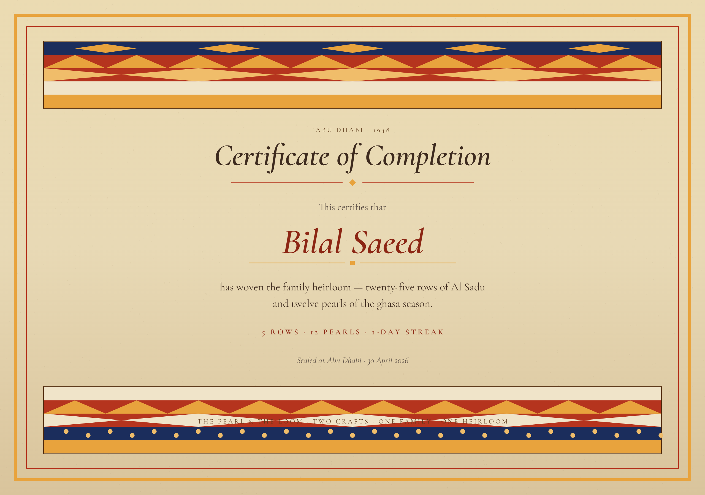
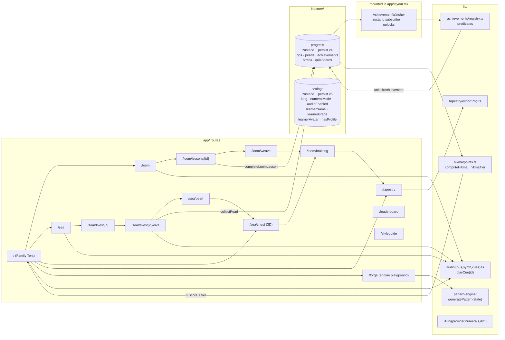

<p align="center">
  
</p>

<h1 align="center">The Pearl and the Loom · اللؤلؤة والنّول</h1>

<p align="center"><em>Two crafts. One family. One heirloom.</em></p>

<p align="center">
  <a href="https://nextjs.org/"></a>
  <a href="https://react.dev/"></a>
  <a href="https://www.typescriptlang.org/"></a>
  <a href="https://tailwindcss.com/"></a>
  <a href="https://zustand-demo.pmnd.rs/"></a>
  <a href="https://www.framer.com/motion/"></a>
  <a href="https://threejs.org/"></a>
  <a href="https://vitest.dev/"></a>
  <a href="https://eslint.org/"></a>
  <a href="https://pnpm.io/"></a>
  
  
</p>

A bilingual UAE-themed gamified learning path. **Layla** weaves Grade 4 math at the Sadu loom inside her family's tent. **Saif** dives Grade 8 science in the *ghasa* (pearling season). The pearls he brings home become beads in her tapestry — one heirloom, braided from two lives. Set in **Abu Dhabi, 1948**.

Submitted to the ADEK Frontend Developer (Interactive UI & Gamification) take-home challenge.

<p align="center">
  
  <br/>
  <sub><em>The Family Tent. Pick a sibling. The chosen path is the lesson.</em></sub>
</p>

---

## Live demo

- **App:** **[pearl-and-loom.vercel.app](https://pearl-and-loom.vercel.app)**
- **Repo:** _(this repo)_
- **Pitch deck:** [`The Pearl and the Loom — ADEK Pitch.pdf`](./public/The%20Pearl%20and%20the%20Loom%20%E2%80%94%20ADEK%20Pitch.pdf)

---

## Walkthrough

<p align="center">
  <a href="https://youtu.be/YLkedUFAqDk" target="_blank" rel="noopener">
    
  </a>
  <br/>
  <sub><a href="https://youtu.be/YLkedUFAqDk" target="_blank" rel="noopener"><strong>▶ Watch on YouTube</strong></a> &nbsp;·&nbsp; narrated tour of every screen</sub>
</p>

---

## Concept

Two UNESCO Intangible Cultural Heritage entries braided into one mechanic — **Al Sadu weaving (2011)** and **Pearling (2005)** — set in 1948 Abu Dhabi.

- **Layla** sits at the Sadu loom. Each Grade 4 math problem she solves — symmetry, equivalent fractions, tessellation, multiplication arrays, geometric angles — weaves a row of the family's tapestry. The math is the loom.
- **Saif** sails on the family's dhow for the *ghasa* season. Each Grade 8 science problem — buoyancy, water pressure at depth, marine biology, lung capacity, light refraction — earns a graded pearl (common, fine, or royal). The science is the dive.

<table>
  <tr>
    <td align="center" width="50%">
      
      <br/>
      <sub><strong>Layla · Lesson 1.</strong> Mirror the motif across the axis. The grid she completes is the next row of the tapestry.</sub>
    </td>
    <td align="center" width="50%">
      
      <br/>
      <sub><strong>Saif · Pressure trial.</strong> Answer correctly before breath runs out — the pearl that surfaces is the grade of the answer.</sub>
    </td>
  </tr>
</table>

Pearls return home and become beads in Layla's tapestry. Completing the curriculum seals the family's heirloom certificate.

<p align="center">
  
  <br/>
  <sub><em>The braid. Saif offers a pearl · the pearl crosses sea-to-tent · Layla weaves it into the row.</em></sub>
</p>

---

## What ships

| Route | What it is |
|---|---|
| `/` | First-run flow (language → profile → tent). Family Tent greets by name. |
| `/loom` + 5 lessons | Symmetry, fractions, tessellation, arrays, angles. The next row of the tapestry previews live as the kid solves. |
| `/sea` + 5 dives | Three core dives (buoyancy / pressure / reef biology) + two deep dives (lung capacity, refraction) gated on the cores. Pre-dive force diagram, in-dive breath gauge, end-of-dive pearl reveal. |
| `/sea/chest` | 3D pearl chest — sandalwood body with brass strapping, mother-of-pearl Sadu inlay on the lid, pearls coloured by tier. R3F + bloom + ACESFilmic, lazy-loaded, paused offscreen, reduced-motion aware. |
| `/forge` | Interactive pattern-engine playground. Sliders for seed, op kind, palette. The deterministic engine produces Sadu rows in real time. Save as PNG. |
| `/atlas` | Educational reference for all 8 Sadu motifs — large render + EN/AR names + cultural meaning + "When woven" occasion + UNESCO ICH 00517 / Sharjah Heritage Institute citations. Each card deep-links to `/forge`. |
| `/tapestry` | Full heirloom view + PNG export + Web Share. Signed PNG certificate downloads after the heirloom completes. |
| `/leaderboard` | Ranked by ✦ Hikma points. Mock data fetched live from `/api/leaderboard` with loading + error fallback. |
| `/styleguide` | Tokens, type ramp, motifs, live tapestry sandbox. |
| `/api/leaderboard` | GET endpoint serving the seeded mock leaderboard (1-day cache header). Demonstrates a real fetch + route-handler pattern without inventing a backend the app doesn't need. |
| `/api/achievements` | GET endpoint serving the achievement catalog (id + motif + bilingual title/tagline/note). Predicates intentionally excluded — they're functions, not transport-safe. |

---

## Evaluation-axis self-mapping

### 1. UAE cultural integration

- 8 authentic Sadu motifs rendered as live SVG with Arabic names: *al-mthalath, al-shajarah, al-eyoun, al-mushat, hubub, dhurs al-khail, uwairjan, khat*.
- **`/atlas`** — full educational reference for every motif with cultural meaning, "When woven" occasion strips, and source citations (UNESCO ICH 00517, Sharjah Heritage Institute, Anthropological Museum of Abu Dhabi).
- Pearling vocabulary in lesson copy: *ghasa, nahham, taab, fattam, deyeen, diveen*.
- 12 achievement badges (Wasm), each a real Sadu motif with a Bedouin weaving footnote.
- Bilingual EN ⇄ AR everywhere, full RTL layout, Tajawal font for Arabic, Arabic-Indic numerals (٠–٩) with a per-user toggle.
- 1948 setting threaded through chrome ("Abu Dhabi · 1948") and the pitch deck.

**Where:** `components/motifs/index.tsx` · `app/atlas/page.tsx` · `lib/achievements/registry.ts` · `lib/i18n/dict/{en,ar}.ts` · `lib/i18n/numerals.ts`

### 2. Visual design

- Two palettes (Sadu indigo / madder / saffron / wool · Sea blue / coral / sunset-gold / foam) under one type system.
- Cormorant Garamond × Tajawal pairing via `next/font/google`.
- Hand-composed SVG portraits (`CinematicLayla`, `SaifOnDeck`).
- 3D pearl chest at `/sea/chest` — sandalwood with brass strapping, mother-of-pearl Sadu inlay on an open lid, bloom + ACESFilmic tone mapping.
- Underwater dive scene with depth fog, animated god rays, particulates, sea grass, caustics.
- `/styleguide` exposes tokens, type ramp, motifs, and a live tapestry sandbox.

<p align="center">
  
  <br/>
  <sub><em>Family Heirloom chest. Brass-strapped sandalwood with mother-of-pearl Sadu inlay; pearls inside grouped by tier; Layla's in-progress weave on the right.</em></sub>
</p>

**Where:** `components/portraits/*.tsx` · `app/sea/chest/page.tsx` · `components/sea/PearlChest3D.tsx` · `components/sea/{DiveScene,fx}.tsx` · `app/styleguide/page.tsx`

### 3. UI / UX

- Branded home header — Profile · Hikma · Leaderboard · Forge · Help · Settings. Mobile hamburger drawer at ≤ 640 px surfaces the Profile + Hikma block.
- Mobile-first responsiveness audited iPhone SE 375 → iPad Air 820 → desktop 1920.
- `TopChrome` on every inner page — back/home + locale chips that collapse to the hamburger on phone.
- 4-step first-visit guided tour with Skip / Back / Next / replay-from-FAQ.
- "How it works" FAQ dialog and an embedded 90-second walkthrough video (Space-bar play/pause).
- `prefers-reduced-motion` respected globally. Audio defaults on, one-tap mute from three nav surfaces.
- `aria-modal` / `aria-live` / `aria-pressed` where relevant; every dialog dismisses on Escape and traps body scroll.

**Where:** `components/layout/{HomeHeader,TopChrome,MobileNav}.tsx` · `components/onboarding/OnboardingTour.tsx` · `components/home/{Tutorial,Walkthrough}Dialog.tsx`

### 4. Micro-animations

- Web Audio API synth, 8 named cues — loom thump, loom shimmer, glass-pearl ping, royal-pearl chord, water splash, UI tap, achievement bells, ceremony chord.
- Loom row weave-in (clip-path reveal + shimmer); cinematic dive plunge; oyster-opens pearl reveal.
- Achievement unlock toast slides down with the motif badge rendered live (Framer Motion enter/exit).
- Saif's animated `saifBreathe` on the dhow, swaying sea grass, rising bubbles.
- 3D pearl chest with Float + click-to-zoom orbit camera.
- Live math → Sadu binding inside lessons — the next tapestry row previews and brightens when the kid's answer lands.
- Heirloom-complete ceremony — staggered row fade-in, ornament reveal, layered chord cue, certificate signing.

<p align="center">
  
  <br/>
  <sub><em>Pre-dive force diagram. Pick a stone — buoyancy vs. weight updates live; "TOO HEAVY" / "TOO LIGHT" verdicts gate the dive.</em></sub>
</p>

**Where:** `lib/audio/{bus,synth,cues}.ts` · `components/sea/{DiveScene,fx,PearlChest3D}.tsx` · `components/loom/lessons/LessonSaduPreview.tsx` · `components/achievements/UnlockToast.tsx` · `components/ceremony/HeirloomCeremony.tsx`

### 5. Student journey / gamification

- **Learner profile** — first-run flow (language → name + grade 4–8 + avatar → tent). Header chips show the avatar, grade, and live ✦ score.
- **Hikma points (✦)** — حِكْمة, "wisdom" — derived (not separately persisted) from existing actions: loom lesson +50, common pearl +20 / fine +50 / royal +100, achievement +30, streak milestones (+30/+70/+140 at 3/7/14 days). Tier badge re-projects the same total: Novice → Weaver → Diver → Master.
- **Grade-aware path nudge** — recommended sibling for the learner's age band (4–5 → Layla, 7–8 → Saif, 6 → balanced). Neither path is locked.
- **End-of-path quizzes** — five questions per sibling, gated until every lesson on that path is finished. Result screen fires confetti on a passing score (4/5+) and awards the *Layla's Apprentice* / *Saif's Apprentice* achievements.
- **Live math → Sadu binding inside lessons** — the next row previews live as the kid solves; brightens with a saffron border + caption when the answer lands.
- **The Forge** (`/forge`) — interactive pattern-engine playground. The deterministic SVG generator, exposed with sliders + a PNG download.
- **Leaderboard** — ranked by ✦ Hikma. The current learner is inserted alongside 8 seeded UAE-themed kids. Top 3 get gold/silver/bronze podium pills; the user row is highlighted.
- **3D pearl chest reveal** — when the kid opens the chest at `/sea/chest`, a real R3F scene mounts: pearls inside, sandalwood walls + brass + mother-of-pearl Sadu inlay on the open lid, click-to-zoom orbit camera.
- **Heirloom-complete ceremony** fires once on completion (5 loom lessons + ≥ 3 pearls). User signs their name; downloads a tapestry-themed PNG certificate. Also accessible from `/tapestry` afterward.
- 12 achievement badges (Wasm), each an authentic Sadu motif with a cultural footnote. Brass-toast slide-in on unlock.
- Daily-weave streak — calendar-day-aware, resets after a 1-day gap. Powers `streak_3` / `streak_7` achievements.
- Tapestry PNG export bakes the user's date / row-count / streak into the saved image; Web Share API for native mobile share.
- Per-user deterministic `seed` exposed as a shareable permalink (`/tapestry?seed=…`) — opens a read-only view of someone else's heirloom.
- Lesson unlock gate (`arrays`, `angles` unlock at 3 core completions).

<table>
  <tr>
    <td align="center" width="50%">
      
      <br/>
      <sub><strong>The Forge.</strong> Sliders drive the deterministic engine; rows render in real time; save the result as a PNG.</sub>
    </td>
    <td align="center" width="50%">
      
      <br/>
      <sub><strong>Heirloom certificate.</strong> Signed PNG download after completing the curriculum (5 lessons + a chest of pearls).</sub>
    </td>
  </tr>
</table>

**Where:** `lib/store/{progress,settings}.ts` · `lib/hikma/points.ts` · `lib/quiz/banks.ts` · `lib/leaderboard/seed.ts` · `app/forge/page.tsx` · `components/sea/PearlChest3D.tsx` · `components/loom/lessons/LessonSaduPreview.tsx` · `components/quiz/*` · `lib/achievements/registry.ts` · `lib/tapestry/{exportPng,buildCertificate}.ts` · `components/ceremony/HeirloomCeremony.tsx`

---

## UAE cultural research

### Al Sadu motif glossary

| ID | Arabic | Latin | Meaning |
|---|---|---|---|
| `mthalath` | المثلث | al-mthalath | Triangles paired tip-to-tip — the most ancient Sadu pattern, taught first to every weaver's daughter. |
| `shajarah` | الشجرة | al-shajarah | Tree of life — woven for cloth meant for a wedding, a birth, or a homecoming. |
| `eyoun` | العيون | al-eyoun | "The eyes" — a guardian motif on tent dividers, woven to ward against ill intent. |
| `mushat` | المشط | al-mushat | "The comb" — references the comb that beats every weft thread tight. |
| `hubub` | حبوب | hubub | Grain seeds — the dot bands a weaver counts under her breath. |
| `dhurs` | ضرس الخيل | dhurs al-khail | "Horse-teeth" — alternating squares in the rhythm of the *nahham*'s breath chant. |
| `uwairjan` | عويرجان | uwairjan | Facing-triangle border — reads the same from either side. |
| `khat` | خط | khat | Warp band separator — once used by merchants to mark the size of a bolt of cloth. |

### Pearling vocabulary

| Term | Arabic | Meaning |
|---|---|---|
| *ghasa* | الغوص | The summer pearling season — 4 months at sea, June through September. |
| *nahham* | النَّهَّام | The dhow's singer, whose chant kept the rhythm of breath for divers. |
| *taab* | الطاب | The diver's noseclip, traditionally tortoiseshell. |
| *fattam* | فطّام | Synonym for *taab* — boys carved their first one at age 12. |
| *deyeen* | الديين | The hand-stitched basket the diver wore around his neck for oysters. |
| *diveen* | الزِّبيل | The honed stone weight tied to the diver's foot for descent. |

Sources: UNESCO ICH Register entries **00517** (Al Sadu, 2011) and **00010** (Pearling, 2005); Heard-Bey, *From Trucial States to United Arab Emirates* (1996, Chs. 4–5); Sheikh Zayed Festival Sadu workshop documentation; Sharjah Heritage Institute publications.

---

## Stack

| Choice | Why |
|---|---|
| Next.js 16 App Router | File-system route groups for `(loom)` / `(sea)` palette layouts; static generation; one-line Vercel deploy. |
| React 19 + TypeScript strict | Strict types enforce store/action contracts and prevent regressions on the Zustand persist migrations. |
| Tailwind v4 | Used sparingly — most styling is inline + scoped `<style>` for one-off textures. |
| Zustand + persist (versioned) | `progress` at v4 (4-step migration chain), `settings` at v5. localStorage only — no backend. |
| React Three Fiber + drei + postprocessing | `/sea/chest` 3D scene. Bloom + ACESFilmic, lazy-loaded via `next/dynamic({ ssr: false })`, `frameloop="demand"`, reduced-motion aware. |
| Web Audio API synth | 8 named cues rendered live via composed `OscillatorNode` + `BufferSourceNode` + `BiquadFilterNode` graphs. Zero audio bytes shipped. |
| Custom canvas tapestry exporter | `lib/tapestry/exportPng.ts` re-implements every Sadu motif natively in `CanvasRenderingContext2D`. |
| Vitest + RTL + jsdom | Jest-API-compatible runner with `@testing-library/react`. Wired into `prebuild` so every Vercel deploy runs typecheck + lint + tests before bundling. |
| Framer Motion | Splash, Forge captions, lesson preview captions, achievement toast enter/exit. Most other animation is CSS keyframes. |

---

## Architecture



---

## Run locally

```bash
pnpm install
pnpm dev          # http://localhost:3000

# focused checks
pnpm typecheck    # tsc --noEmit
pnpm lint         # eslint
pnpm test         # vitest run

# orchestrated
pnpm verify       # typecheck && lint && test  ← hooked into prebuild
pnpm build        # runs verify automatically, then next build
```

Node ≥ 20 required.

---

## Quality pipeline

`package.json` declares a `prebuild` lifecycle hook that runs typecheck + lint + tests before `next build`. Applies locally and on Vercel. If any check fails, the production build fails.

```text
pnpm build
  └─ prebuild
       └─ pnpm verify
            ├─ pnpm typecheck     (tsc --noEmit)
            ├─ pnpm lint          (eslint)
            └─ pnpm test          (vitest run)
  └─ next build                   (only if verify passed)
```

Current state on a fresh checkout: 0 TypeScript errors, 0 ESLint errors, 109 tests passing (107 + 2 skipped).

---

## Testing

13 test files under Vitest + jsdom + `@testing-library/react`. Two specs are skipped under jsdom — `tapestry-export` (Canvas not host-able) and the audio synth smoke (Web Audio not host-able); both run in real browsers. Test runner is wrapped with `cross-env NODE_ENV=test` so React 19's `act` is available even when the parent shell sets `NODE_ENV=production` (Vercel's build runner).

**Pure-logic unit tests:**

| File | Coverage |
|---|---|
| `tests/pattern-engine.test.ts` | PRNG seeded by `seed + rowIndex`, op-application invariants, motif math. |
| `tests/numerals.test.ts` | Western ↔ Arabic-Indic conversion, mode resolution, formatter integration. |
| `tests/progress-streak.test.ts` | `bumpStreak` calendar math under a frozen system clock — same-day no-op, +1 day increment, gap > 1 day reset. |
| `tests/achievements.test.ts` | Table-driven predicate coverage for every entry in `ACHIEVEMENTS` plus bilingual-content sanity. |
| `tests/tapestry-composition.test.ts` | TAPESTRY_25 has 25 rows, every motif resolves, every pearl-bearing row uses a valid grade. |
| `tests/pearl-colors.test.ts` | `PEARL_TIERS` integrity — every grade, well-formed hex / rgba, escalating glow size, royal-only ring. |
| `tests/tapestry-export.test.ts` | Smoke: `buildTapestryPng` resolves to a PNG `Blob` (skipped under non-canvas). |
| `tests/hikma-points.test.ts` | `computeHikma` reward table including streak milestones; `hikmaTier` band partitioning at 150 / 400 / 800. |
| `tests/settings-profile.test.ts` | Profile fields — name truncation, grade range, avatar tokens, profile-setup composition, profile reset. |
| `tests/quiz-banks.test.ts` | Both quiz banks — 5 questions each, valid correct index, 4 EN + 4 AR options, bilingual prompt + explainer. |
| `tests/progress-quiz.test.ts` | `recordQuizScore` tracks bestScore, layla/saif tracked independently, `markCompleted` idempotent, `startedAt` stamp-once. |
| `tests/leaderboard.test.ts` | `buildLeaderboard` — seed-only without profile, "you" inserted with first-name normalised, sorted by hikma desc, tiebreak rules. |

**Component-render tests** (`@testing-library/react`):

| File | Coverage |
|---|---|
| `tests/components.test.tsx` | `<HikmaCounter>` (live derivation + tier band), `<UnlockToast>` (render + click-to-dismiss + 3.5s auto-dismiss), `<ProfileChip>` (null vs profile-set states), `<LessonSaduPreview>` (locked-caption reveal), `<TitleReveal>` (full text + aria-label, semantic tag override, custom label). |

Deliberately not tested: E2E, visual regression, audio output (no headless WebAudio in CI), Framer Motion timelines, R3F scene rendering. The integrity + component-render tests above catch the regressions those would.

---

## ADRs (architectural decisions)

### ADR-001 · Custom SVG pattern engine over pre-baked images

**Decision.** Build a deterministic, op-log-driven SVG tapestry generator (`lib/pattern-engine/`) rather than baking 25 PNG row variants.

**Why.** The math binds to the cloth. Symmetry / fractions / tessellation lessons each emit a typed `PatternOp` that the engine resolves into Sadu motif rows. The tapestry visibly grows as students answer correctly — and the same engine drives `/forge`, the interactive playground.

**Trade-off.** Higher up-front cost; harder for non-engineers to design new motifs. Mitigation: motif components are isolated in `components/motifs/index.tsx` and easy to extend.

### ADR-002 · Web Audio API synth over sample files

**Decision.** Render every audio cue live via `OscillatorNode` + `BufferSourceNode` + `BiquadFilterNode` graphs (`lib/audio/synth.ts`) rather than shipping mp3/wav sample files.

**Why.** No third-party audio license — every byte is original. Zero asset weight. Audio cues stay deterministic across browsers; no decoding fallbacks.

**Trade-off.** Synth-rendered audio sounds slightly more "synthetic" than a curated wav. Mitigation: cue recipes layer noise + bell partials + pitched bass to read as wood/glass/water rather than pure tones.

### ADR-003 · Home-rolled i18n vs `next-intl`

**Decision.** A ~100-line `lib/i18n/provider.tsx` with typed dictionaries (`Dict = typeof en`) and a `useT()` hook, instead of `next-intl` or `react-intl`.

**Why.** Bundle weight (next-intl is ~15 KB gzip) and total control over RTL — `<html dir>` from a context, `dir="ltr"` SVG canvas wrappers, Arabic-Indic numerals via a custom `<NumeralText>`. All easier without a library's opinion on each.

**Trade-off.** No pluralization / interpolation library features. Acceptable: this codebase has no plural-forms problems and uses template literals for interpolation.

### ADR-004 · Mock data only, no backend

**Decision.** All persistence is `localStorage` via Zustand `persist` middleware. No API routes, no database, no auth.

**Why.** The brief explicitly accepts mock data. A backend would not score on any rubric axis (the role is *frontend*) and would introduce failure surface (DNS / SSL / DB downtime) that could break the submission on judging day.

**Trade-off.** Can't move data across devices. Offset by the `?seed=` permalink — the deterministic per-user seed is shareable as a URL.

### ADR-005 · One R3F surface, route-scoped

**Decision.** Ship one ~400-LoC R3F scene at `/sea/chest` instead of a full 3D world. Lazy-loaded via `next/dynamic({ ssr: false })`, `frameloop="demand"`, reduced-motion aware.

**Why.** The chest is where the player's pearls actually live — the scene is bound to gameplay rather than decoration. One mount point keeps the bundle lean and the perf cost predictable.

**Trade-off.** Smaller WebGL footprint than a multi-scene approach. Could expand later (custom water shader for the dive intro, animated 3D loom for `/loom`) without re-architecting — the existing scene is route-scoped, so additions stay cleanly isolated.

---

## Asset credits

| Asset | Source |
|---|---|
| All SVG art (motifs, characters, dhow, oysters, ornaments, favicon) | Authored for this project (some compositions iterated via Claude Design exports). |
| 3D scene primitives (chest body, lid, pearls) | Composed from drei + standard three primitives — no imported `.glb` or third-party model. |
| Audio cues | Rendered live via Web Audio API. No sample files. |
| Fonts | Tajawal & Cormorant Garamond (both Open Font License) via `next/font/google`. |
| Pitch deck PDF | Authored for this project. |
| Walkthrough video | Self-contained inline HTML with embedded base64-audio data URIs (`public/Pearl-and-Loom-inline.html`). |

---

## Accessibility

- **RTL** — full Tailwind v4 logical properties (`ms-`, `me-`, `ps-`, `pe-`) plus `inline-start` / `inline-end` everywhere. Tapestry SVG internals are `dir="ltr"` so motif coordinates stay positive-X-right while the *frame* flips with locale.
- **Numerals** — `<NumeralText mode="auto" | "western" | "arabic-indic">`. Math problems render in active mode; URLs and lesson IDs stay western for routing stability.
- **Audio** — defaults on, persisted, one-tap mute (header chip + hamburger drawer + per-page TopChrome chip).
- **Bilingual TTS narration** — every loom and dive question carries a 🔊 *Read aloud* button driven by the Web Speech API (`SpeechSynthesisUtterance`). Voice picked from the active locale's BCP-47 chain (`en-US/en-GB/en` or `ar-AE/ar-SA/ar-EG/ar`). Real accessibility for Grade 4/8 learners who can't read every word fluently. Graceful fallback when no voice is installed; doesn't render at all if `speechSynthesis` is unavailable. (`components/ui/SpeakButton.tsx`.)
- **Reduced motion** — `@media (prefers-reduced-motion: reduce)` clamps animations globally; the R3F chest drops auto-rotate, freezes Float, uses `frameloop="demand"`. Framer-motion's `useReducedMotion()` collapses every page transition + Hikma-counter tween + tapestry weave-in to instant. The audio toggle is independent (motion ≠ audio).
- **Keyboard** — every dialog is `aria-modal`, dismisses on Escape, traps body scroll while open.
- **Live regions** — `aria-live="polite"` on the achievement unlock toast and tapestry save toasts.

---

## What's next

- **Active palette feeding the pattern engine.** `/forge` exposes the knobs to a reviewer; tying those choices into per-user progress would let the heirloom inherit a palette decision.
- **Larger R3F surface.** A custom water shader for the dive intro, or an animated 3D loom for `/loom`, would broaden the WebGL footprint without bloating the bundle.
- **Voice narration.** Short EN/AR clips for Layla and Saif's intros.
- **Native-speaker Arabic review pass.** Translations were proofed against Heard-Bey's transliteration norms; a native reviewer pass would catch any subtle register issues.

---

*Submitted by Bilal Saeed Ahmed for the ADEK Frontend Developer (Interactive UI & Gamification) take-home, April 29th 2026.*
